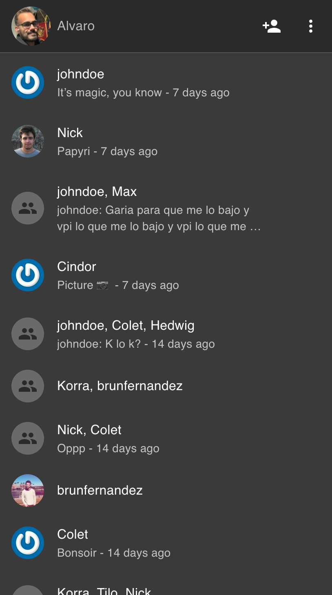
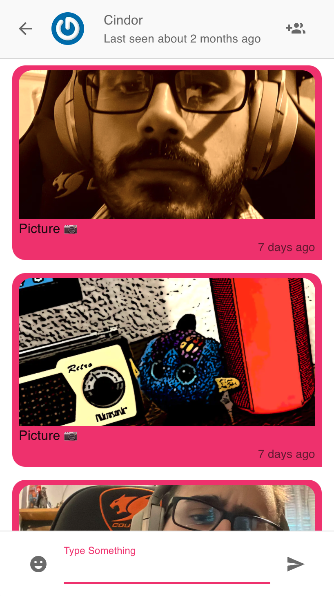

# Obligatorio DIU

Aplicación de chat para web con React (NEXT.js) y mobile con React Native + Expo. Para manejo de estado usamos Apollo (GraphQL). El backend que comparten ambas versiones está hecho con NestJS.

## Configuración de ambiente de desarrollo

Primero que nada, este es un monorepo mantenido con `lerna`. Por ello, cada comando que ejecutemos desde la raíz será ejecutado contra todo el monorepo y no contra ninguna aplicación en particular.

Para instalar las dependencias y vincular los proyectos entre sí ejecutar el siguiente comando:

```bash
yarn
```

### Aplicación web

Se encuentra en el directorio `packages/obli-diu`. Movámonos a ese directorio:

```bash
cd packages/obli-diu
```

Crear un archivo `.env.local` con la configuración de la aplicación.

```ini
NEXT_PUBLIC_API_URL=obli-diu.herokuapp.com/api/graphql
```

El ejemplo sirve para conectarse al backend de testing deployado.

Luego, iniciar el servidor de desarrollo:

```bash
yarn dev
```

Abre [http://localhost:3000](http://localhost:3000) con tu navegador para ver el resultado.

Puedes empezar a editar el sitio modificando `pages/index.js`. La página se actualiza automáticamente a medida que vayas editando.

### Aplicación mobile

Para configurar la versión mobile nos movemos a `packages/mobile`.

```bash
cd packages/mobile
```

Creamos un archivo `.env.local` con la configuración de la aplicación.

```ini
API_URL=obli-diu.herokuapp.com/api/graphql
CLOUDINARY_CLOUD_NAME=
CLOUDINARY_UPLOAD_PRESET=
```

El ejemplo sirve para conectarse al backend de testing deployado.

Luego, iniciar el metro bundler:

```bash
yarn dev
```

## Principales decisiones de diseño

### Mobile

- Framework de diseño: [`react-native-elements`](https://reactnativeelements.com/)
- Patrón de diseño: [Tab navigation](http://ui-patterns.com/patterns/NavigationTabs)

### Web

- Framework de diseño: [Material-UI](https://v4.mui.com/)
- Patrón de diseño: [Master-Detail](https://blogs.windows.com/windowsdeveloper/2017/05/01/master-master-detail-pattern/)

### Comunes

- Delegación de la foto de perfil Gravatar (servicio externo)

### Implementación de Master-Detail en web

Hicimos uso de media queries (las cuales pudimos simplificar gracias a que Material-UI provee breakpoints estándar) y de props que expone el componente Grid de MUI.

```js
const MyScreen = () => {
  const classes = useStyles();

  return (
    <Grid container>
      <Grid
        xs={12}
        md={3}
        item
        className={`${classes.sidebar} ${className}`}></Grid>
      <Grid item sm={12} md={9} className={classes.messageGrid}></Grid>
    </Grid>
  );
};

const useStyles = makeStyles((theme) => ({
  sidebar: {
    display: 'none',
  },
  [theme.breakpoints.up('md')]: {
    sidebar: {
      display: 'flex',
    },
  },
}));
```

El ejemplo anterior sirve para ilustrar cómo ocultamos por defecto el sidebar (lista de chatrooms) y en pantallas `md` hacia arriba se muestra. Esto es, a su vez, un ejemplo del concepto mobile-first.

### Foto de perfil

Para cumplir con el requerimiento de la foto de perfil, tomamos la decisión de usar un servicio externo a la aplicación. Para contar con una foto de perfil es necesario registrarse en https://en.gravatar.com/ y asociar una foto de perfil al email con el que se hizo el registro en la aplicación. Una vez realizado esto, se comenzará a ver la foto de perfil en el chat. Este servicio es usado por sitios como NPM.

### Heurísticas de Nielsen

- Estado del sistema: mantenemos su visibilidad por medio de loading indicators que avisan al usuario cuando hay algo que está cargando.
- Consistencia y estándares: MUI es una implementación de un lenguage de diseño con el que los usuarios están familiarizados en general.
- Reconocer en lugar de recordar: idem anterior.
- Estética y diseño minimalista: al haber usado Material Design con MUI nos fue muy fácil mantener este atributo.
- Ayuda al usuario a reconocer, diagnosticar y recuperarse de los errores: cada llamada al servidor que falla (como un login con contraseña incorrecta) resulta en un Snackbar de MUI que muestra un mensaje.
- Ayuda y documentación: cuando no hay chats mostramos un mensaje que explica al usuario qué hacer para empezar a usar el sistema.

### Componentes/conceptos utilizados

- Popups (modals) para presentar contenido que no hay necesidad de mantener siempre en la pantalla. Por ejemplo: cuando queremos crear un nuevo chat mostramos la lista de usuarios posibles en uno de éstos.
- Popovers para presentar menús contextuales. Por ejemplo: cuando el usuario va a desloguearse encuentra el botón en un popover que se abre al hacer click en el botón de los tres puntitos.
- Navegación mobile: cuando estamos en pantallas más chicas que lo definido por el breakpoint `md` de MUI mostramos una flecha para ir hacia atrás en la vista del chat.

### Principios de Gestalt

1. Principio de proximidad: al haber aplicado Master-Detail tenemos que todos los chatrooms, que forman una lista, están próximos los unos a los otros en su parte de la pantalla; mientras tanto los mensajes están en su sección separada.
2. Principio de similaridad: todos los chatrooms que aparecen en la lista de la izquierda se ven iguales mientras que los mensajes de la derecha se ven iguales entre sí pero no hay forma de confundir un chatroom con un mensaje. Se representan de forma distinta pero consistente.
3. Principio de continuidad: tanto para los chatrooms como los mensajes dentro de un chat utilizamos listas, los elementos están organizados en una línea recta y así damos más sensación de que los elementos están relacionados.
4. Principio de cierre: el modo en el que agrupamos los elementos (las listas, nuevamente) genera la ilusión de que forman grupos cerrados.
5. Principio de figura-fondo: lo aplicamos con el uso de modals para traer al frente la funcionalidad de crear nuevos chatrooms.
6. Principio de región común: idem principio de cierre.

### Screenshots


| Web mobile (responsive)                                         | Mobile (Native)                                           |
| --------------------------------------------------------------- | --------------------------------------------------------- |
|  |     |
|  |      |
|  |  |

## Estructura del repositorio

El repositorio es un monorepo mantenido con [`lerna`](https://lerna.js.org/), es decir, tenemos un directorio llamado `packages` dentro del cual está todo el código que trabajamos separado en paquetes independientes. Así pudimos crear un proyecto `shared` en el que pusimos todo el código compartido entre `web` y `mobile` (lógica de negocios encapsulada en hooks, schemas de validación, helpers, etc.) y luego las aplicaciones independientes.

Fue muy sencillo extraer la lógica de negocios del primer obligatorio para reutilizarla en mobile pues ya habíamos puesto todo en hooks. Hubo que hacer cambios menores pero la idea se mantuvo.

El desafío más grande fue hacer que Next.js y Expo pudieran compilar el proyecto compartido, el cual al ser una dependencia que hay que transpilar (y las dependencias no se suelen transpilar) genera problemas. Luego de solucionar eso no fue muy trivial lograr que Vercel pudiese buildear y deployar el proyecto Next.js.

## Estructura de la aplicación React (aplica a web y, con pequeñas salvedades, a mobile)

La aplicación está organizada, en primer lugar, a partir de lo que propone Next.JS. Es decir, el punto de entrada de las rutas es lo que se encuentra en la carpeta `pages`. Utilizamos el routeo automático que provee el framework así que nuestro archivo `home.js` lo accedemos en la ruta `/home`. En mobile las páginas no siguen esta convención de nombrado pero sí las mantenemos dentro del directorio `pages`.

Cada una de estas rutas hacen uso de cierta lógica de negocios, la cuál está toda organizada entre contexts y hooks. Utilizamos contexts para mantener ciertas porciones de estado global como estado de carga, error y tema (dark o light) mientras que los hooks para la lógica de listar chatrooms y suscribirse a sus actualizaciones, entre otros. Estos hooks y contexts son los que pusimos en el proyecto `shared` para poder compartirlos entre `web` y `mobile` con algunas excepciones particulares que eran muy acopladas a la plataforma en la que se estaba como, por ejemplo, el `makeStyles` que armamos para la aplicación mobile.

Para beneficiarnos de la componentización que propone React hicimos componentes reutilizables, como el `Sidebar`, que dejamos en la carpeta `components`. Estos no están asociados a ninguna ruta, están para ser utilizados por componentes que sí lo están.

## Deploy

La aplicación web está deployada en Vercel, como recomienda el framework Next.JS. La misma está accesible [aquí](https://obli-diu.vercel.app/).

Por su parte la aplicación mobile está pública en Expo [aquí](https://expo.dev/@mrnkr/mobile).

Tuvimos problemas haciendo funcionar la API dentro de Vercel como una función serverless por lo que tuvimos que deployar el backend aparte en Heroku. Esto está directamente relacionado con el hecho de que utilizamos Nest.JS como framework para organizar nuestra API.

La misma se encuentra hosteada [aquí](https://obli-diu.herokuapp.com/api/graphql) y el repositorio correspondiente a la aplicación es [este](https://github.com/mrnkr/chat-api).
